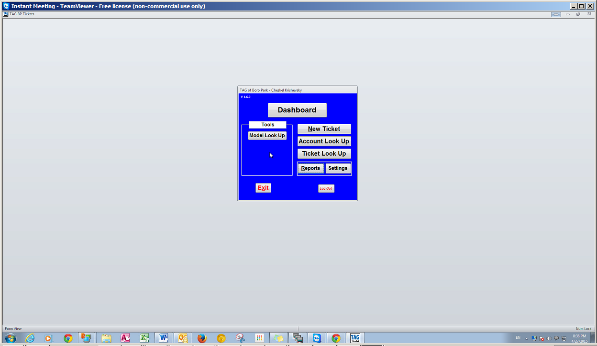
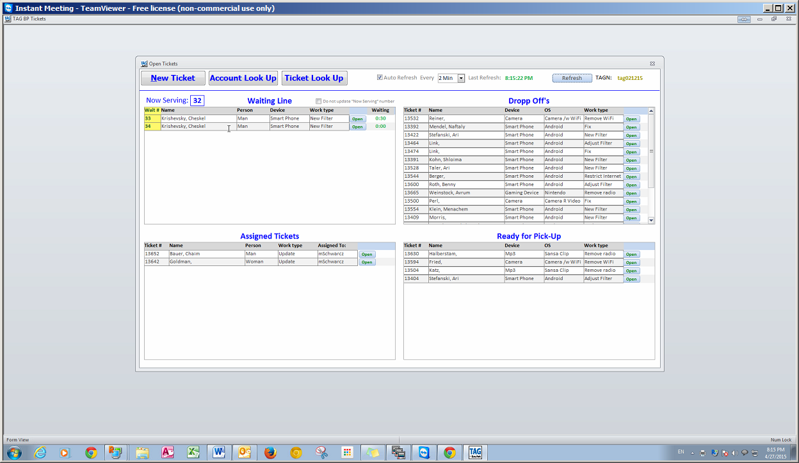
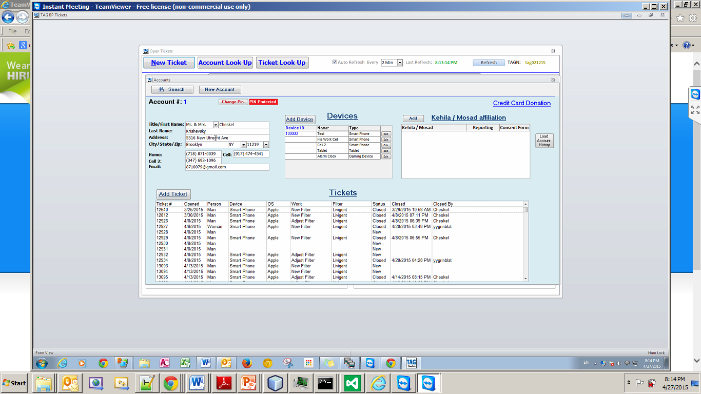
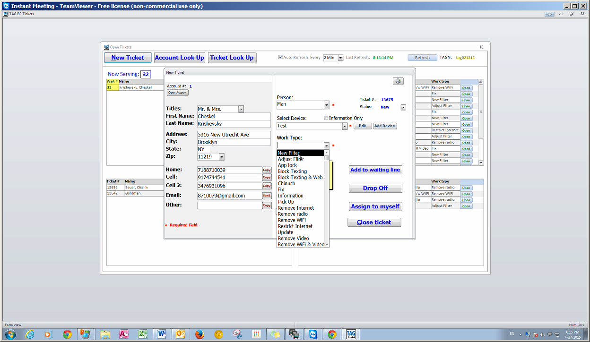
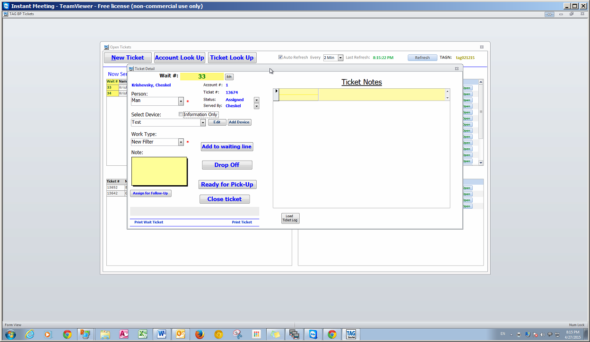
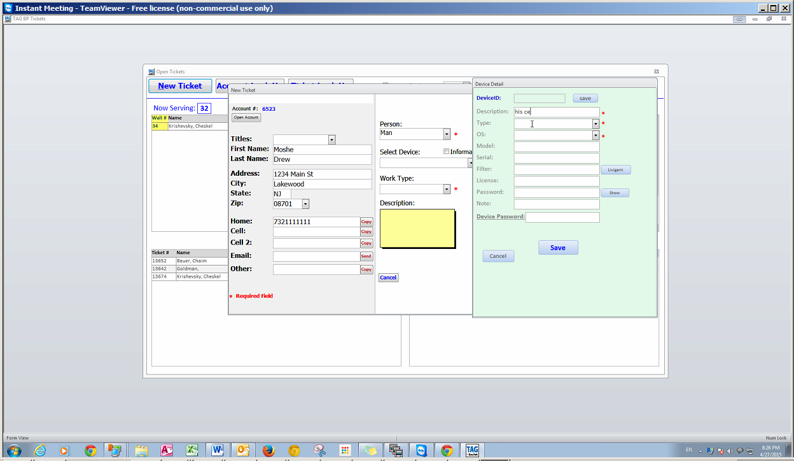
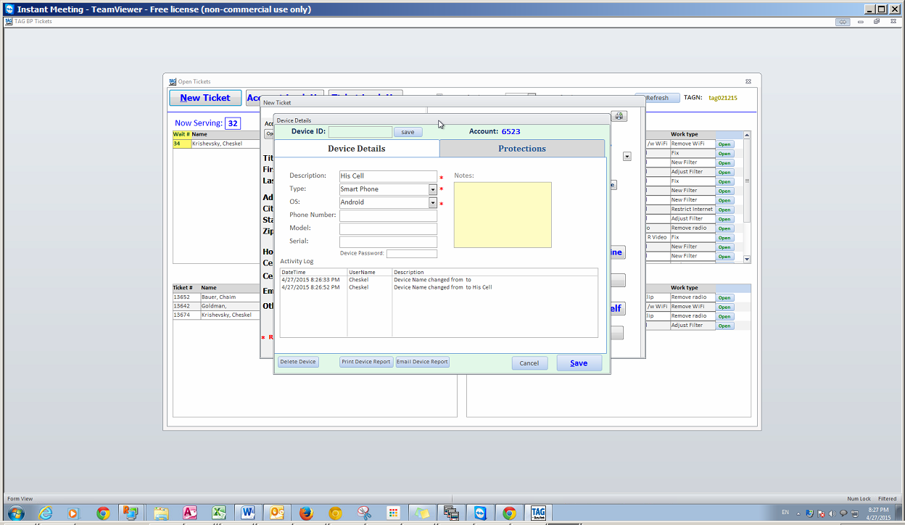

TAG Ticketing System. (Name TBD)
================================

System Description
------------------

### Agent Login

Agent will login to the system to authenticate.  Agents can be active or inactive. It is to be determined if some agents will get elevated permissions, and what actions are restricted to only those agents.

### Ticketing

A ticket represents an interaction between a TAG volunteer and the client that was being helped. The purpose of tracking the tickets is 1. So that tasks can be assigned and queued up for the appropriate agent. 2. Tickets are valuable for reporting and management purposes. Looking back at the tickets will give the TAG staff valuable information about what is being done in all the TAG offices.  

Agents can create a NEW ticket in response to a client:

1.  Walk in
2.  Telephone
3.  Email (optional)
4.  Chat (?)

The following is a list of ticket types derived from the TAG Boro Park system. These are just a suggested list, and the ticket behavior is likely to be the same regardless of which ticket type selected. But these are useful buckets for tracking work performed.

1.  New Filter
2.  Adjust Filter
3.  App Lock
4.  Block Texting
5.  Block Texting and Web
6.  Chinuch
7.  Fix
8.  Information
9.  Pick Up
10. Remove Internet
11. Remove WIFI
12. Restrict Internet
13. Update
14. Remove Video
15. Remove WIFI and Video
16. Other ..

A ticket is associated with

1.  An account.
2.  A device

A ticket can be in one of the following states.

1.  New
2.  Waiting in line (for walk in)
3.  Drop off (for drop off)
4.  Assigned
5.  Resolved / Completed
6.  Ready for Pick Up (for drop off)
7.  Cancelled

A ticket can be assigned to an Agent. There should be some notification to the agent that a ticket has been assigned to him. When an agent assigns a ticket to himself no notification is necessary.

### Accounts Users Devices and Filters

An account represents a family, or a group of individuals that belong together. Within an account it makes sense to track the users since there could easily be different protections required for different users within one family. For example a lady may allow shopping sites on her user account that the husband doesn’t want to be able to access.

A user can have one or more devices.         

Devices can have one or more filters or protections associated with them. It’s important to track the specific details of each device such as anti-virus or OS / Browser version since this information could be important in cases of remote support.

A device should have a tagged number with a tamper proof sticker.

The filter configuration has the license and password required for the TAG agent to make the required changes for the client. The system should be able to make use of this information to facilitate the actual handling of the requested change. For example the system could host an admin page in an iframe for quick access to make changes. In general the system should help improve agent workflow wherever possible by providing the appropriate information and wiki instructions for each action required.

### Reports

The following are some of the reports that the system should be capable of generating.

1.  How many tickets of each type have been handled by each office per day
2.  What are the most common requests per office for dial ins, for walk ins
3.  Web sites most commonly requested to be blocked / allowed.
4.  The average time it takes to process a walk in request. Dial in request.
5.  Notfication to users who have a certain kind of device or use a certain type of filter.

                                                                

### Email capabilities

The system should be able to send email notification for the following events

1.  To the client when a request has been submitted
2.  To the client when a request has been completed with a summary of what action has been done.
3.  To the client when a pick up is ready
4.  To an agent when a ticket is assigned to him.

### Printed receipts and waiting numbers for walk-in request

1.  TAG Boro Park has a good system where walk-in clients get a number and then wait for their turn to be helped. This is helpful for tracking waiting times and keeping the peace.
2.  Walk-in clients can get a printed receipt instead of or in addition to email notification

                                                                

### Data Objects

Name             | Description
-----------------|------------------------------------------------
Agent            | A TAG Agent fulfill a request
Account          | General Account information
User             | Man/Woman /Bochur
Device           | Full list of Devices and OS
Filter           | Filter or protection for a device with details
Ticket           | The tickets with history
Action Type List | List of Possible Ticket Action Types
Notes            | Searchable table, more than one per ticket
Office Location  | Tag Office Location

### Services API

Agent

-   New Agent
-   Update Agent
-   Delete Agent

Account

-   New Account
-   Get Account Details (search by… )
-   Update Account
-   Delete Account
-   Add user
-   Remove user
-   Add Comment

User

-   Add Device
-   Remove Device
-   Add Comment

Device

-   Add Filter
-   Get Filter Details
-   Update Filter
-   Remove Filter
-   Add Comment

Ticket

-   New Ticket
-   Get Ticket Details
-   Find Ticket
-   Update Ticket
-   Update Ticket State
-   Delete Ticket
-   Add Comment
-   Delete Ticket

Ticket Action

-   Get List of Actions

TAG Office

-   Get List of Locations

Device

-   Get Device List
-   Add Device
-   Delete Device

Questions and concerns

1.  What kind of Account / User information should be stored, and who can have access to it. We need to be careful with privacy concerns. We don’t want to collect a who’s who database or allow data to be misused in any way.

Appendix A Screenshots from TAG Boro Park
-----------------------------------------

The intention is NOT to copy this system, but to look carefully for any features that we should look to include.

Main Menu

Different views of the Active Tickets

Look up an Account. We are not adding the “Mosad” association since that didn’t work out.

New Ticket

Add Notes to a New Ticket

Add a device to a new ticket

Notice that the device too has a notes

